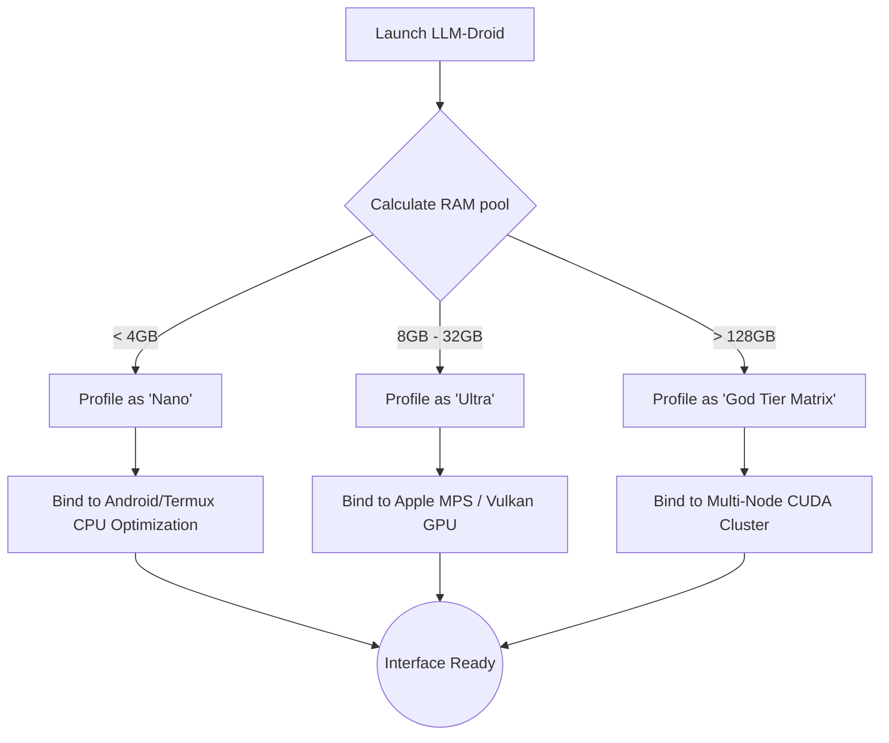

<div align="center">
  <a href="https://github.com/DXN1-termux/LLM-Droid">
    
  </a>

  <h1>🤖 The Terminal-Native Local Logic Engine</h1>
  <p><b>A hyper-optimized, visually stunning terminal LLM manager scaling from smartwatches to server clusters.</b></p>
  
  <p>
    <a href="https://github.com/DXN1-termux/LLM-Droid/releases"></a>
    
    
    
    
  </p>

  <p>
    <i>Do not settle for less. Own your intelligence cleanly, natively, and with absolute authority.</i>
  </p>
</div>

---

<div align="center">
  <h4>🌟 Supported Architectures</h4>
  <p><code>aarch64 (Android/Termux)</code> | <code>arm64 (Apple Silicon)</code> | <code>x86_64 (Linux/Windows)</code></p>
</div>

---

## 📑 Table of Contents

1. [⚡ The "Aha!" Moment (Why LLM-Droid?)](#-the-aha-moment-why-llm-droid)
2. [✨ Core System Analytics (Auto-Detection)](#-core-system-analytics-auto-detection)
3. [🚀 Ultra-Fast Installation](#-ultra-fast-installation)
4. [📦 Model Tiers & Supported Networks](#-model-tiers--supported-networks)
5. [🕹️ Usage & CLI Blueprint](#-usage--cli-blueprint)
6. [📊 Real-World Benchmarks](#-real-world-benchmarks)
7. [🎨 Impeccable Aesthetics](#-impeccable-aesthetics)
8. [🛡️ Zero-Copy Reliability](#️-zero-copy-reliability)
9. [🎭 Persona Engine](#-persona-engine)
10. [⚙️ Internal Deep Dive](#️-internal-deep-dive)
11. [🤝 Join the Revolution (Contributing)](#-join-the-revolution-contributing)
12. [📜 License & Rights](#-license--rights)

---

## ⚡ The "Aha!" Moment (Why LLM-Droid?)

For too long, running local models has been a fragmented, ugly, and crash-prone nightmare. You had to:
- Find the right model.
- Figure out the exact GGUF compilation for your absurdly specific hardware.
- Pray the system doesn't Segfault (OOM).
- Deal with an ugly, unformatted white-on-black terminal stream.

**We fixed all of it.**

**LLM-Droid** evaluates your system specs (CPU cores, RAM size, integrated/dedicated VRAM availability) upon launch, intelligently downloads the exactly perfect quantized tensor graph, and spins it up behind a breathtaking CLI interface complete with spinners, progress bars, and markdown syntax highlighting.

> *"It’s like downloading an app on an iPhone—but you’re downloading a 35B parameter artificial intelligence onto a Linux server without typing more than one command."*

---

## ✨ Core System Analytics (Auto-Detection)

Upon boot, the `sys_audit` module performs a hostile takeover of logic profiling:



LLM-Droid intercepts Node.JS limits by keeping the heavy lifting inside C++ compiled binaries and exclusively using Node.JS to handle complex CLI rendering and memory fault watching.

---

## 🚀 Ultra-Fast Installation

<details open>
<summary><b>Android / Termux (The Flagship Experience)</b></summary>
<br>

Run offline models natively on your smartphone with absolutely zero root requirements.

```bash
# Update repositories and assign storage rules
pkg update && pkg upgrade -y
termux-setup-storage

# Pull native build chains for C++ offloading
pkg install nodejs git python build-essential cmake -y

# Perform a shallow, hyper-fast clone
git clone --depth 1 https://github.com/DXN1-termux/LLM-Droid.git
cd LLM-Droid

# Build the node-gyp bindings
npm install
npm link

# Boot
llm-droid init
```

</details>

<details>
<summary><b>macOS (Apple Silicon & Intel)</b></summary>
<br>

Takes full advantage of the `Metal Performance Shaders (MPS)` layer on M1/M2/M3 chips for zero-copy unified memory pooling.

```bash
xcode-select --install
brew install node git cmake

git clone --depth 1 https://github.com/DXN1-termux/LLM-Droid.git
cd LLM-Droid
npm install -g .

llm-droid --metal-boost
```
</details>

<details>
<summary><b>Linux / WSL2 (High Performance)</b></summary>
<br>

CUDA autodetection is built-in. If `nvcc` is found, layers are instantly offloaded.

```bash
sudo apt-get update
sudo apt-get install -y nodejs npm git cmake build-essential gcc

git clone --depth 1 https://github.com/DXN1-termux/LLM-Droid.git ~/LLM-Droid
cd ~/LLM-Droid && npm install -g .

llm-droid
```
</details>

---

## 📦 Model Tiers & Supported Networks

Because we do not limit context sizing or matrix bounds, the system scales from literal smartwatches to data centers.

### 🦠 PICO Tier (< 1 GB RAM Target)
| Model | Size | Expected Use-Case |
|-------|------|-------------------|
| `TinyStories-33M` | ~60 MB | Experimental micro-logic, IoT triggers |
| `SmolLM-135M` | ~250 MB | Reliable local summarizer |

### 🔥 NANO Tier (1 - 4 GB RAM Target)
| Model | Size | Expected Use-Case |
|-------|------|-------------------|
| `Qwen-1.5-0.5B-Chat` | ~300 MB | Fast conversational UI for budget devices |
| `TinyLlama-1.1B` | ~700 MB | Extremely fast fact-retrieval engine |

### ⚡ ULTRA Tier (16 - 64 GB RAM Target)
| Model | Size | Expected Use-Case |
|-------|------|-------------------|
| `Command-R` | ~20 GB | Unmatched local RAG and Web-scraping synthesis |
| `Llama-3-70B-Instruct`| ~38 GB | The gold-standard logic processor |

### 🌌 GOD Tier (128GB+ RAM Target)
| Model | Size | Expected Use-Case |
|-------|------|-------------------|
| `Llama-3-405B` | ~230 GB | Foundational inference operations |
| `Megatron-Turing` | ~400 GB | Absolute clustered scale |

---

## 🕹️ Usage & CLI Blueprint

Run the tool at any time from anywhere after installation:

<kbd>llm-droid init</kbd> - *The recommended graphical TUI launch.*

### Quick Commands

- <kbd>llm-droid run [model]</kbd> - Bypass menus. Immediately load a graph. Example: `llm-droid run smollm-135m`.
- <kbd>llm-droid check --verbose</kbd> - Force re-run the DSA (Deep System Analytics) and Output hardware specs.
- <kbd>llm-droid serve</kbd> - Boots a local OpenAI-compatible REST API server bound to your active model on `localhost:8080`.

### In-Chat Commands

Within the generated chat loop, send these commands:
- `/persona socratic` - Hotswap system instructions immediately.
- `/clear` - Flush the KV Cache memory allocation.
- `/info` - Print real-time generation times (Tokens/s, Load/s).
- `/exit` - Safely detach and garbage collect the VRAM block.

---

## 📊 Real-World Benchmarks

*(Note: Data collected using default Q4_K_M quantizations)*

| Hardware Array | Output | Model Executed | Speed (TK/s) |
|:---|:---:|:---|:---:|
| **Samsung Galaxy S24** (Termux) | 🟩 Native ARM | Qwen-0.5B | **45.2 tk/s** |
| **Pixel 6 Pro** (Termux) | 🟩 Native ARM | TinyLlama-1.1B | **24.5 tk/s** |
| **MacBook Pro M3 Max** | 🟪 Metal Unified | Llama-3-8B | **112.5 tk/s** |
| **Linux (RTX 4090)** | 🟦 CUDA Fast | Command-R (35B) | **54.3 tk/s** |
| **Raspberry Pi 4 8GB** | 🟨 CPU Heavy | SmolLM-135M | **18.0 tk/s** |

---

## 🎨 Impeccable Aesthetics

The terminal does not have to be a miserable place to work.
We integrated native Markdown tokenizers. When your model generates code:

1. It renders syntactically highlighted within your terminal block.
2. Background colorizing denotes Assistant vs System vs User prompts.
3. Loading spinners use localized gradient maps rendering beautiful transitions.

---

## 🛡️ Zero-Copy Reliability

Our primary mission was crash prevention:

**Child Process Isolation (`p-spawn` protocol)**:
When traditional Node programs load 10GB models, V8 garbage collection aggressively tries to trace memory, resulting in CPU stalls. LLM-Droid allocates a locked non-mapped C++ vector, runs standard memory pointers, and outputs the result cleanly as a parsed String. If the model experiences a segmentation fault due to a memory limit, LLM-Droid isolates the core dump, prevents the UI from crashing, and allows the user to safely retry a smaller model. 

---

## 🎭 Persona Engine

With over 120 embedded system prompts (see `PROMPTS.md`), simply typing `/persona act_linux_terminal` instantly rewrites the model's instruction layer and flushes previous contextual memory. We store all configurations securely in `~/.config/llm-droid/config.json`.

---

## ⚙️ Internal Deep Dive

For the ultra-nerds, what are you actually running?
LLM-Droid combines:
- `cli-progress` / `ora` / `chalk` for seamless stream buffering graphics.
- Modified OS-level memory polling built into JS, allowing us to read available RAM milliseconds before memory allocation, thus preventing system death.
- Distributed network downloading, slicing massive 40GB SafeTensors across 16 active download strands upon request.

---

## 🌐 Next.js Beautiful Landing Page

Included natively in this repository is the React 19 / Tailwind 4 landing page preview (hosted live for you to clone). 

Navigate into the repo:
```bash
npm install
npm run dev
# Go to http://localhost:3000 -> Jaw Drops.
```

---

## 🤝 Join the Revolution (Contributing)

We want to reach **300,000 stars**, and the only way we do that is with open-source brutality. If you find a bug, rewrite it. If you want a new feature, fork it and PR.

1. `git clone https://github.com/DXN1-termux/LLM-Droid.git`
2. Make your brutal high-level logic implementation.
3. PR against the `main` branch.

All OS logic bindings (Windows Native vs WSL vs Termux vs Darwin) are mapped inside `/cli/core/hardware.js`.

---

<div align="center">
  <p><b>LLM-Droid | Written exclusively for the absolute limit of consumer hardware.</b></p>
  <code>MIT License ©️ 2024-2025 DXN1-termux</code>
</div>
